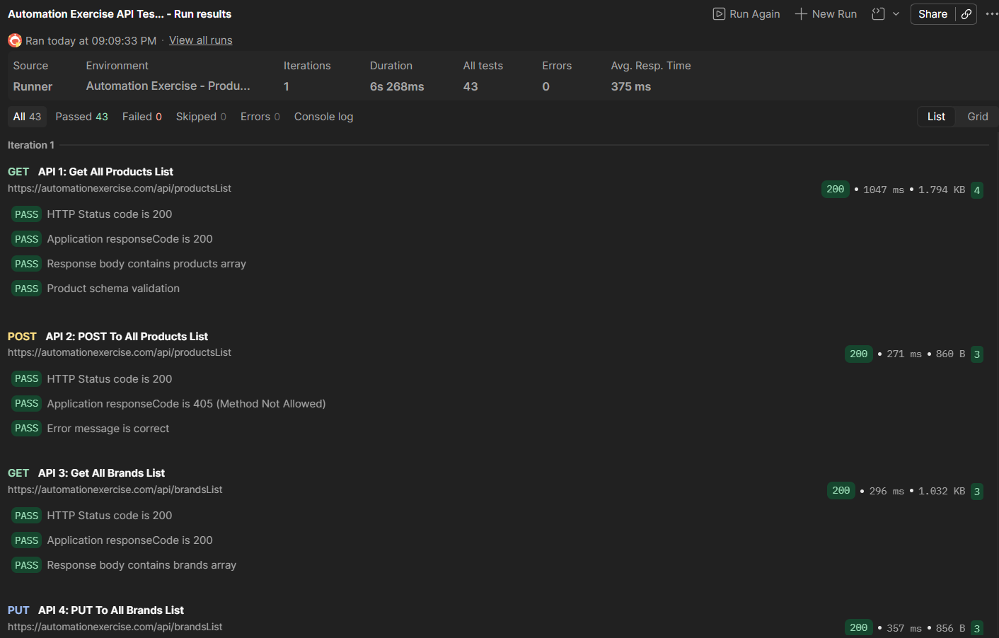
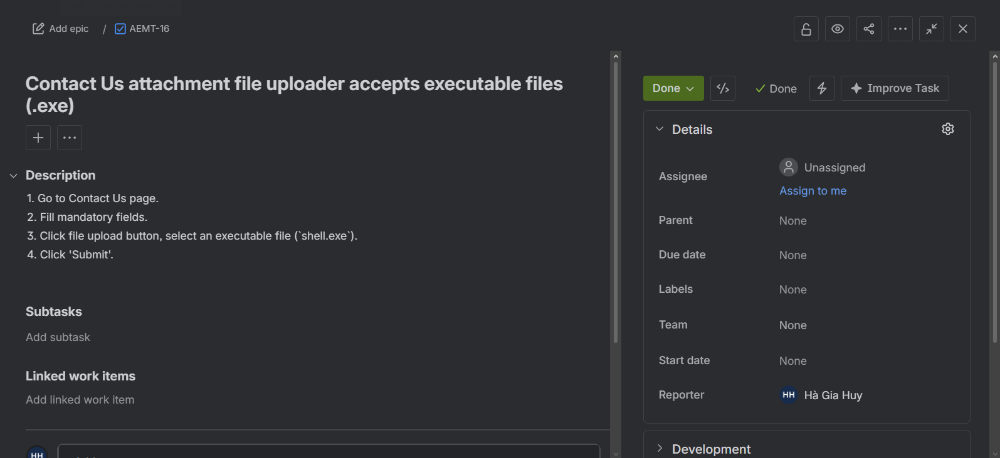

# Manual Testing Practice: E-Commerce Web Application (Automation Exercise)

[](https://automationexercise.com/)
[](#)
[](#)
[](#)
[](#)

A professional-grade manual testing project targeting the live testing platform **[Automation Exercise](https://automationexercise.com)**. This repository houses complete, industry-standard quality assurance (QA) artifacts including a **Test Plan**, a suite of **50+ Test Cases**, a **Defect Tracking Log** with 15+ mapped bugs, and a functional **Postman API Test Collection** covering 10+ core routes.

---

## 🔗 Interactive Deliverables
*   📊 **[Interactive Google Sheets Test Cases](https://docs.google.com/spreadsheets/d/19zpmimS6btTzFb2tLk7lABqU07lK2KmzURq3aucCX_Q/edit?usp=sharing)** - View the fully formatted 52 test cases with color-coded execution states.

---

## 📊 Test Execution Dashboard

This dashboard summarizes the results of the manual and API testing cycles executed against the SUT.

### 1. Test Case Execution Summary
*   **Total Test Cases Designed:** 52
*   **Total Test Cases Executed:** 52 (100% execution rate)
*   **Passed Test Cases:** 36
*   **Failed Test Cases:** 16
*   **Overall Pass Rate:** $\approx 69.2\%$

```
[████████████████████████████████████████                    ] 69.2% (Passed)
```

| Module / Feature Area | Test Cases | Executed | Passed | Failed | Pass Rate | Linked Defects |
| :--- | :---: | :---: | :---: | :---: | :---: | :--- |
| **Registration & Account Management** | 10 | 10 | 8 | 2 | 80% | BUG-001, BUG-002 |
| **Login & Logout** | 10 | 10 | 9 | 1 | 90% | BUG-003 |
| **Product Catalog & Search** | 10 | 10 | 7 | 3 | 70% | BUG-004, BUG-005, BUG-006 |
| **Shopping Cart & Actions** | 10 | 10 | 6 | 4 | 60% | BUG-007, BUG-008, BUG-009, BUG-010 |
| **Checkout, Billing & Payments** | 12 | 12 | 6 | 6 | 50% | BUG-011, BUG-012, BUG-013, BUG-014, BUG-015 |
| **General & Contact Us** | 2 | 2 | 1 | 1 | 50% | BUG-016 |
| **TOTAL** | **52** | **52** | **36** | **16** | **69.2%** | |

### 2. Defect Severity & Priority Distribution
A total of **16 defects** were identified, documented, and cross-referenced with failing test cases.

| Severity / Priority | High (P1) | Medium (P2) | Low (P3) | Total |
| :--- | :---: | :---: | :---: | :---: |
| 🚨 **Critical** | 4 | 0 | 0 | **4** |
| 🔴 **High** | 4 | 2 | 0 | **6** |
| 🟡 **Medium** | 0 | 3 | 0 | **3** |
| 🔵 **Low** | 0 | 0 | 3 | **3** |
| **Total** | **8** | **5** | **3** | **16** |

---

## 📂 Repository Structure & Artifacts

Explore the testing deliverables using the links below:

```
├── README.md                              <-- (You are here) Project summary & dashboard
├── test-artifacts/
│   ├── test-plan.md                       <-- Strategy, environments, and scope specifications
│   ├── test-cases.md                      <-- 52 test cases written in Markdown format
│   ├── test-cases.csv                     <-- Spreadsheet version for importing to Google Sheets/Excel
│   ├── bug-reports.md                     <-- 16 detailed bug reports with reproduction steps
│   └── bug-reports.csv                    <-- Bug list database for importing to Jira/Trello
└── api-testing/
    ├── README.md                          <-- Instructions to import and run Postman tests
    ├── AutomationExercise_API.postman_collection.json    <-- 14 requests with JS assertions
    └── AutomationExercise_Env.postman_environment.json   <-- Collection environment variables
```

*   **[QA Test Plan](test-artifacts/test-plan.md):** Defines our testing scope, cross-browser strategy, and exit criteria.
*   **[Test Case Suite (Markdown)](test-artifacts/test-cases.md) / [(CSV Spreadsheet)](test-artifacts/test-cases.csv):** Detailed specifications of steps and expectations.
*   **[Defect Tracking Log (Markdown)](test-artifacts/bug-reports.md) / [(CSV Spreadsheet)](test-artifacts/bug-reports.csv):** Formatted bug reports ready for import.
*   **[Postman API Collection](api-testing/AutomationExercise_API.postman_collection.json) / [API Readme](api-testing/README.md):** Active backend requests with validation scripts.

---

## 🛠️ Tools & Technologies Used
*   **Google Sheets / Excel:** Used for writing, formatting, and structured partitioning of the test case suite.
*   **Postman:** API route validation, assertions scripting, and environment variables control.
*   **Jira / Trello:** Defect tracking board simulation (CSVs provided in repo are pre-configured for bulk importing).
*   **Chrome DevTools:** Used for DOM element analysis, CSS layouts debugging, console monitoring, and network payload inspections.

---

## 🧪 Automated API Test Run

The Postman API test suite was executed against the production environment of the SUT. All 43 assertions passed successfully, validating the functional correctness and response schemas of the backend endpoints.



---

## 📋 Jira Defect Tracking Board

All 16 defects discovered during testing have been successfully documented, managed, and tracked using a custom Kanban board in **Jira Software**. 

Below are the screenshots demonstrating the active defect workflow and the structure of a detailed bug ticket in Jira:

### 1. Active Kanban Board
The board shows the current status of all issues distributed across standard columns: *To Do*, *In Progress*, *In Review*, and *Done*.


### 2. Mapped Jira Ticket Detail
A sample defect ticket showing structured description fields detailing steps to reproduce, expected vs actual results, and associated priority settings:


---

## 🌟 References & Links
*   **Target Web Application:** [Automation Exercise](https://automationexercise.com)
*   **API Documentation:** [Automation Exercise API List](https://automationexercise.com/api_list)
*   **Testing Tool:** [Postman](https://www.postman.com/)

