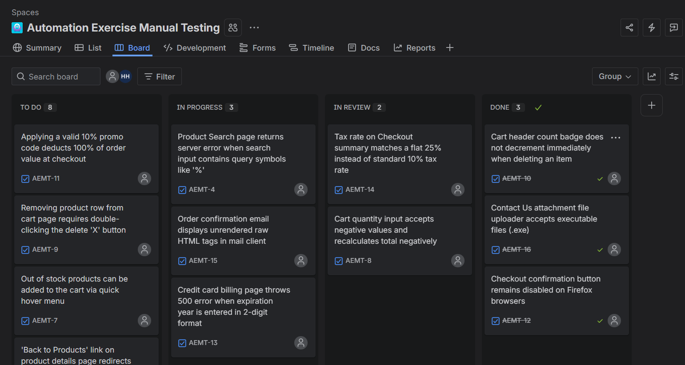

# Defect Reports: Automation Exercise

This document details the **16 defects** discovered during manual functional, UI, and compatibility testing on the **Automation Exercise** website.
Each bug is linked back to its failing test case in [test-cases.md](test-cases.md).

> [!NOTE]
> All 16 defects listed below have been successfully imported and are tracked on an active Kanban board inside **Jira Software**.
> 
> 

> [!TIP]
> You can download the raw database version in [bug-reports.csv](bug-reports.csv) to import directly into Jira, Trello, or other issue tracking systems.

---

## Defect Summary Table

| Defect ID | Title | Module | Severity | Priority | Status |
| :--- | :--- | :--- | :--- | :--- | :--- |
| [BUG-001](#bug-001) | Registration detail page permits empty inputs for mandatory profile fields | Registration & Account Management | 🔴 **High** | High (P1) | **New/Open** |
| [BUG-002](#bug-002) | Raw database SQL query error displayed during signup with special characters in Name field | Registration & Account Management | 🚨 **Critical** | High (P1) | **New/Open** |
| [BUG-003](#bug-003) | 'Remember me' session login token is not persisted after browser restart | Login & Logout | 🟡 **Medium** | Medium (P2) | **New/Open** |
| [BUG-004](#bug-004) | Product Search page returns server error when search input contains query symbols like '%' | Product Catalog & Search | 🔴 **High** | Medium (P2) | **New/Open** |
| [BUG-005](#bug-005) | Sidebar category menu collapses and fails to navigate on iOS Safari mobile viewports | Product Catalog & Search | 🔴 **High** | High (P1) | **New/Open** |
| [BUG-006](#bug-006) | 'Back to Products' link on product details page redirects to homepage instead of filtered listing | Product Catalog & Search | 🔵 **Low** | Low (P3) | **New/Open** |
| [BUG-007](#bug-007) | Out of stock products can be added to the cart via quick hover menu | Shopping Cart & Cart Actions | 🔴 **High** | High (P1) | **New/Open** |
| [BUG-008](#bug-008) | Cart quantity input accepts negative values and recalculates total negatively | Shopping Cart & Cart Actions | 🚨 **Critical** | High (P1) | **New/Open** |
| [BUG-009](#bug-009) | Removing product row from cart page requires double-clicking the delete 'X' button | Shopping Cart & Cart Actions | 🔵 **Low** | Low (P3) | **New/Open** |
| [BUG-010](#bug-010) | Cart header count badge does not decrement immediately when deleting an item | Shopping Cart & Cart Actions | 🟡 **Medium** | Medium (P2) | **New/Open** |
| [BUG-011](#bug-011) | Applying a valid 10% promo code deducts 100% of order value at checkout | Checkout, Billing & Payments | 🚨 **Critical** | High (P1) | **New/Open** |
| [BUG-012](#bug-012) | Checkout confirmation button remains disabled on Firefox browsers | Checkout, Billing & Payments | 🔴 **High** | High (P1) | **New/Open** |
| [BUG-013](#bug-013) | Credit card billing page throws 500 error when expiration year is entered in 2-digit format | Checkout, Billing & Payments | 🚨 **Critical** | High (P1) | **New/Open** |
| [BUG-014](#bug-014) | Tax rate on Checkout summary matches a flat 25% instead of standard 10% tax rate | Checkout, Billing & Payments | 🟡 **Medium** | Medium (P2) | **New/Open** |
| [BUG-015](#bug-015) | Order confirmation email displays unrendered raw HTML tags in mail client | Checkout, Billing & Payments | 🔵 **Low** | Low (P3) | **New/Open** |
| [BUG-016](#bug-016) | Contact Us attachment file uploader accepts executable files (.exe) | General & Contact Us | 🔴 **High** | High (P1) | **New/Open** |

---

## Detailed Defect Specifications

### 🐞 BUG-001: Registration detail page permits empty inputs for mandatory profile fields
*   **Module/Feature:** Registration & Account Management
*   **Severity:** 🔴 **High**
*   **Priority:** High (P1)
*   **Environment:** Chrome v120 / Windows 11
*   **Reference Test Case:** [TC-REG-005](test-cases.md#tc-reg-005)
*   **Status:** Open / New

#### 📝 Steps to Reproduce:
1. Navigate to 'https://automationexercise.com/login'.
2. Enter name 'Test User' and email 'new_register_empty@test.com' under Signup, click 'Signup'.
3. Leave Password, First Name, Last Name, and Address fields empty.
4. Click 'Create Account'.

#### 🎯 Expected Result:
System validation fails, alerting user about required empty fields.

#### ⚠️ Actual Result:
Form successfully submits; account is created with null/empty essential fields, leading to errors in checkout profile reference.

#### 🖼️ Defect Tracking & Evidence:
*   **Jira Ticket:** **AEMT-1** (Tracked in Jira Software - See [Jira Board Screenshot](../README.md#1-active-kanban-board))
*   **Evidence Screenshot:** Attached directly to Jira ticket AEMT-1 (including environment details and reproduction console logs)

---
### 🐞 BUG-002: Raw database SQL query error displayed during signup with special characters in Name field
*   **Module/Feature:** Registration & Account Management
*   **Severity:** 🚨 **Critical**
*   **Priority:** High (P1)
*   **Environment:** Chrome v120 / Windows 11
*   **Reference Test Case:** [TC-REG-006](test-cases.md#tc-reg-006)
*   **Status:** Open / New

#### 📝 Steps to Reproduce:
1. Navigate to signup details screen.
2. In 'First Name' field, input: `John' OR '1'='1`.
3. Complete remaining fields with valid values.
4. Click 'Create Account' button.

#### 🎯 Expected Result:
Inputs are sanitized before query execution. User registration proceeds or handles special characters as literal text.

#### ⚠️ Actual Result:
Screen redirects to a database exception traceback showing raw SQL query details, indicating vulnerability to SQL injection.

#### 🖼️ Defect Tracking & Evidence:
*   **Jira Ticket:** **AEMT-2** (Tracked in Jira Software - See [Jira Board Screenshot](../README.md#1-active-kanban-board))
*   **Evidence Screenshot:** Attached directly to Jira ticket AEMT-2 (including environment details and reproduction console logs)

---
### 🐞 BUG-003: 'Remember me' session login token is not persisted after browser restart
*   **Module/Feature:** Login & Logout
*   **Severity:** 🟡 **Medium**
*   **Priority:** Medium (P2)
*   **Environment:** Edge v120 / Windows 11
*   **Reference Test Case:** [TC-LOG-005](test-cases.md#tc-log-005)
*   **Status:** Open / New

#### 📝 Steps to Reproduce:
1. Navigate to login screen, enter valid credentials, and check 'Remember me' checkmark.
2. Click 'Login' (Success).
3. Close browser completely.
4. Relaunch browser and go back to 'https://automationexercise.com'.

#### 🎯 Expected Result:
Login session cookie remains active; header displays 'Logged in as [Name]'.

#### ⚠️ Actual Result:
User session is completely wiped, requiring user to log in again. Session cookie is missing expiration date (treated as session-only).

#### 🖼️ Defect Tracking & Evidence:
*   **Jira Ticket:** **AEMT-3** (Tracked in Jira Software - See [Jira Board Screenshot](../README.md#1-active-kanban-board))
*   **Evidence Screenshot:** Attached directly to Jira ticket AEMT-3 (including environment details and reproduction console logs)

---
### 🐞 BUG-004: Product Search page returns server error when search input contains query symbols like '%'
*   **Module/Feature:** Product Catalog & Search
*   **Severity:** 🔴 **High**
*   **Priority:** Medium (P2)
*   **Environment:** Chrome v120 / Firefox v120
*   **Reference Test Case:** [TC-CAT-005](test-cases.md#tc-cat-005)
*   **Status:** Open / New

#### 📝 Steps to Reproduce:
1. Navigate to 'Products' page.
2. Input symbol `%` in search field.
3. Click search button.

#### 🎯 Expected Result:
Page displays zero results found gracefully.

#### ⚠️ Actual Result:
Application throws standard HTTP 500 error or raw URL decoding server crash.

#### 🖼️ Defect Tracking & Evidence:
*   **Jira Ticket:** **AEMT-4** (Tracked in Jira Software - See [Jira Board Screenshot](../README.md#1-active-kanban-board))
*   **Evidence Screenshot:** Attached directly to Jira ticket AEMT-4 (including environment details and reproduction console logs)

---
### 🐞 BUG-005: Sidebar category menu collapses and fails to navigate on iOS Safari mobile viewports
*   **Module/Feature:** Product Catalog & Search
*   **Severity:** 🔴 **High**
*   **Priority:** High (P1)
*   **Environment:** Mobile Safari / iOS 17.2
*   **Reference Test Case:** [TC-CAT-007](test-cases.md#tc-cat-007)
*   **Status:** Open / New

#### 📝 Steps to Reproduce:
1. Access website on iPhone Safari.
2. Scroll to Categories section.
3. Tap 'Women' to expand subcategories.
4. Tap 'Dress' subcategory link.

#### 🎯 Expected Result:
Category updates smoothly and directs viewport to Women-Dress catalog page.

#### ⚠️ Actual Result:
Tapping expands the category menu but instantly collapses it without executing the page redirection.

#### 🖼️ Defect Tracking & Evidence:
*   **Jira Ticket:** **AEMT-5** (Tracked in Jira Software - See [Jira Board Screenshot](../README.md#1-active-kanban-board))
*   **Evidence Screenshot:** Attached directly to Jira ticket AEMT-5 (including environment details and reproduction console logs)

---
### 🐞 BUG-006: 'Back to Products' link on product details page redirects to homepage instead of filtered listing
*   **Module/Feature:** Product Catalog & Search
*   **Severity:** 🔵 **Low**
*   **Priority:** Low (P3)
*   **Environment:** Chrome v120
*   **Reference Test Case:** [TC-CAT-010](test-cases.md#tc-cat-010)
*   **Status:** Open / New

#### 📝 Steps to Reproduce:
1. Navigate to Products page and click 'Polo' brand in filter sidebar.
2. Click 'View Product' for one of the filtered items.
3. Click the 'Back to Products' button on details screen.

#### 🎯 Expected Result:
User returns to the filtered Polo brand catalog view.

#### ⚠️ Actual Result:
User is redirected to the main store homepage, losing the active brand filter configuration.

#### 🖼️ Defect Tracking & Evidence:
*   **Jira Ticket:** **AEMT-6** (Tracked in Jira Software - See [Jira Board Screenshot](../README.md#1-active-kanban-board))
*   **Evidence Screenshot:** Attached directly to Jira ticket AEMT-6 (including environment details and reproduction console logs)

---
### 🐞 BUG-007: Out of stock products can be added to the cart via quick hover menu
*   **Module/Feature:** Shopping Cart & Cart Actions
*   **Severity:** 🔴 **High**
*   **Priority:** High (P1)
*   **Environment:** Chrome v120
*   **Reference Test Case:** [TC-CRT-004](test-cases.md#tc-crt-004)
*   **Status:** Open / New

#### 📝 Steps to Reproduce:
1. Search for a product that is out of stock (quantity = 0).
2. Hover over the item card in product list.
3. Click the 'Add to Cart' button from the overlay.

#### 🎯 Expected Result:
Hover overlay button is disabled or hidden for out-of-stock items.

#### ⚠️ Actual Result:
Product is added to the cart successfully, allowing checkout of unfulfillable inventory.

#### 🖼️ Defect Tracking & Evidence:
*   **Jira Ticket:** **AEMT-7** (Tracked in Jira Software - See [Jira Board Screenshot](../README.md#1-active-kanban-board))
*   **Evidence Screenshot:** Attached directly to Jira ticket AEMT-7 (including environment details and reproduction console logs)

---
### 🐞 BUG-008: Cart quantity input accepts negative values and recalculates total negatively
*   **Module/Feature:** Shopping Cart & Cart Actions
*   **Severity:** 🚨 **Critical**
*   **Priority:** High (P1)
*   **Environment:** Chrome v120 / Firefox v120
*   **Reference Test Case:** [TC-CRT-006](test-cases.md#tc-crt-006)
*   **Status:** Open / New

#### 📝 Steps to Reproduce:
1. Add 'Blue Top' to shopping cart and navigate to Cart view.
2. Click quantity input box.
3. Type '-2' and hit Enter.

#### 🎯 Expected Result:
Input validation replaces the value with '1' or displays an error.

#### ⚠️ Actual Result:
Cart row total and cart grand total update to a negative currency balance (e.g. -$58.00).

#### 🖼️ Defect Tracking & Evidence:
*   **Jira Ticket:** **AEMT-8** (Tracked in Jira Software - See [Jira Board Screenshot](../README.md#1-active-kanban-board))
*   **Evidence Screenshot:** Attached directly to Jira ticket AEMT-8 (including environment details and reproduction console logs)

---
### 🐞 BUG-009: Removing product row from cart page requires double-clicking the delete 'X' button
*   **Module/Feature:** Shopping Cart & Cart Actions
*   **Severity:** 🔵 **Low**
*   **Priority:** Low (P3)
*   **Environment:** Chrome v120
*   **Reference Test Case:** [TC-CRT-007](test-cases.md#tc-crt-007)
*   **Status:** Open / New

#### 📝 Steps to Reproduce:
1. Add a product to cart and go to Cart page.
2. Click the red 'X' button in the product row once.

#### 🎯 Expected Result:
Product row is deleted immediately on a single click.

#### ⚠️ Actual Result:
Row remains active. Clicking the button a second time removes the item.

#### 🖼️ Defect Tracking & Evidence:
*   **Jira Ticket:** **AEMT-9** (Tracked in Jira Software - See [Jira Board Screenshot](../README.md#1-active-kanban-board))
*   **Evidence Screenshot:** Attached directly to Jira ticket AEMT-9 (including environment details and reproduction console logs)

---
### 🐞 BUG-010: Cart header count badge does not decrement immediately when deleting an item
*   **Module/Feature:** Shopping Cart & Cart Actions
*   **Severity:** 🟡 **Medium**
*   **Priority:** Medium (P2)
*   **Environment:** Firefox v120
*   **Reference Test Case:** [TC-CRT-008](test-cases.md#tc-crt-008)
*   **Status:** Open / New

#### 📝 Steps to Reproduce:
1. Add two items to cart (badge count shows '2').
2. Navigate to Cart page.
3. Click delete button for one product (Row disappears).

#### 🎯 Expected Result:
Header cart badge count decreases to '1' dynamically.

#### ⚠️ Actual Result:
Header badge count remains '2' until a manual page refresh is triggered.

#### 🖼️ Defect Tracking & Evidence:
*   **Jira Ticket:** **AEMT-10** (Tracked in Jira Software - See [Jira Board Screenshot](../README.md#1-active-kanban-board))
*   **Evidence Screenshot:** Attached directly to Jira ticket AEMT-10 (including environment details and reproduction console logs)

---
### 🐞 BUG-011: Applying a valid 10% promo code deducts 100% of order value at checkout
*   **Module/Feature:** Checkout, Billing & Payments
*   **Severity:** 🚨 **Critical**
*   **Priority:** High (P1)
*   **Environment:** Chrome v120
*   **Reference Test Case:** [TC-CHK-005](test-cases.md#tc-chk-005)
*   **Status:** Open / New

#### 📝 Steps to Reproduce:
1. Add products to cart and proceed to Checkout page.
2. Enter valid promo code 'DISCOUNT10' (intended for 10% reduction).
3. Click 'Apply' button.

#### 🎯 Expected Result:
Subtotal is reduced by exactly 10%, reflecting a 90% customer payment balance.

#### ⚠️ Actual Result:
Promo code deducts the entire total ($0.00 due balance), allowing orders to be processed for free.

#### 🖼️ Defect Tracking & Evidence:
*   **Jira Ticket:** **AEMT-11** (Tracked in Jira Software - See [Jira Board Screenshot](../README.md#1-active-kanban-board))
*   **Evidence Screenshot:** Attached directly to Jira ticket AEMT-11 (including environment details and reproduction console logs)

---
### 🐞 BUG-012: Checkout confirmation button remains disabled on Firefox browsers
*   **Module/Feature:** Checkout, Billing & Payments
*   **Severity:** 🔴 **High**
*   **Priority:** High (P1)
*   **Environment:** Firefox v120 / Windows 11
*   **Reference Test Case:** [TC-CHK-006](test-cases.md#tc-chk-006)
*   **Status:** Open / New

#### 📝 Steps to Reproduce:
1. Access cart as logged-in user in Firefox browser.
2. Click 'Proceed to Checkout'.
3. Review address details and scroll to the bottom.

#### 🎯 Expected Result:
'Place Order' button is enabled and clickable.

#### ⚠️ Actual Result:
Button displays disabled cursor style and ignores clicks, blocking all Firefox users from purchasing.

#### 🖼️ Defect Tracking & Evidence:
*   **Jira Ticket:** **AEMT-12** (Tracked in Jira Software - See [Jira Board Screenshot](../README.md#1-active-kanban-board))
*   **Evidence Screenshot:** Attached directly to Jira ticket AEMT-12 (including environment details and reproduction console logs)

---
### 🐞 BUG-013: Credit card billing page throws 500 error when expiration year is entered in 2-digit format
*   **Module/Feature:** Checkout, Billing & Payments
*   **Severity:** 🚨 **Critical**
*   **Priority:** High (P1)
*   **Environment:** Chrome v120
*   **Reference Test Case:** [TC-CHK-007](test-cases.md#tc-chk-007)
*   **Status:** Open / New

#### 📝 Steps to Reproduce:
1. Proceed to payment page with items.
2. Enter valid card details.
3. In Expiration Year field, input: `28` (instead of `2028`).
4. Click 'Pay and Confirm Order'.

#### 🎯 Expected Result:
Form intercepts input and prompts user for 4-digit format, or normalizes it to '2028'.

#### ⚠️ Actual Result:
Page crashes with an unhandled server exception: 'DateTimeParseException: Year must be 4 digits'.

#### 🖼️ Defect Tracking & Evidence:
*   **Jira Ticket:** **AEMT-13** (Tracked in Jira Software - See [Jira Board Screenshot](../README.md#1-active-kanban-board))
*   **Evidence Screenshot:** Attached directly to Jira ticket AEMT-13 (including environment details and reproduction console logs)

---
### 🐞 BUG-014: Tax rate on Checkout summary matches a flat 25% instead of standard 10% tax rate
*   **Module/Feature:** Checkout, Billing & Payments
*   **Severity:** 🟡 **Medium**
*   **Priority:** Medium (P2)
*   **Environment:** Chrome v120
*   **Reference Test Case:** [TC-CHK-009](test-cases.md#tc-chk-009)
*   **Status:** Open / New

#### 📝 Steps to Reproduce:
1. Add a $10.00 product to cart and checkout.
2. Look at Tax calculation line in totals summary.

#### 🎯 Expected Result:
Tax line displays '$1.00' (10% standard rate).

#### ⚠️ Actual Result:
Tax line displays '$2.50' (applying a 25% flat rate without logic explanation).

#### 🖼️ Defect Tracking & Evidence:
*   **Jira Ticket:** **AEMT-14** (Tracked in Jira Software - See [Jira Board Screenshot](../README.md#1-active-kanban-board))
*   **Evidence Screenshot:** Attached directly to Jira ticket AEMT-14 (including environment details and reproduction console logs)

---
### 🐞 BUG-015: Order confirmation email displays unrendered raw HTML tags in mail client
*   **Module/Feature:** Checkout, Billing & Payments
*   **Severity:** 🔵 **Low**
*   **Priority:** Low (P3)
*   **Environment:** Gmail Mail Client / Chrome v120
*   **Reference Test Case:** [TC-CHK-012](test-cases.md#tc-chk-012)
*   **Status:** Open / New

#### 📝 Steps to Reproduce:
1. Checkout and purchase items successfully.
2. Open order confirmation email received in inbox.

#### 🎯 Expected Result:
Email has styled tables and message elements.

#### ⚠️ Actual Result:
Email displays plaintext containing raw markup, e.g. `Dear Customer,   Your order <b>#1029</b> was successful.`

#### 🖼️ Defect Tracking & Evidence:
*   **Jira Ticket:** **AEMT-15** (Tracked in Jira Software - See [Jira Board Screenshot](../README.md#1-active-kanban-board))
*   **Evidence Screenshot:** Attached directly to Jira ticket AEMT-15 (including environment details and reproduction console logs)

---
### 🐞 BUG-016: Contact Us attachment file uploader accepts executable files (.exe)
*   **Module/Feature:** General & Contact Us
*   **Severity:** 🔴 **High**
*   **Priority:** High (P1)
*   **Environment:** Chrome v120
*   **Reference Test Case:** [TC-GEN-001](test-cases.md#tc-gen-001)
*   **Status:** Open / New

#### 📝 Steps to Reproduce:
1. Go to Contact Us page.
2. Fill mandatory fields.
3. Click file upload button, select an executable file (`shell.exe`).
4. Click 'Submit'.

#### 🎯 Expected Result:
Form validation checks file extensions and blocks dangerous script file types.

#### ⚠️ Actual Result:
Form submits successfully, uploading the binary executable file directly to the web server storage.

#### 🖼️ Defect Tracking & Evidence:
*   **Jira Ticket:** **AEMT-16** (Tracked in Jira Software - See [Jira Board Screenshot](../README.md#1-active-kanban-board))
*   **Evidence Screenshot:** Attached directly to Jira ticket AEMT-16 (including environment details and reproduction console logs)

---
